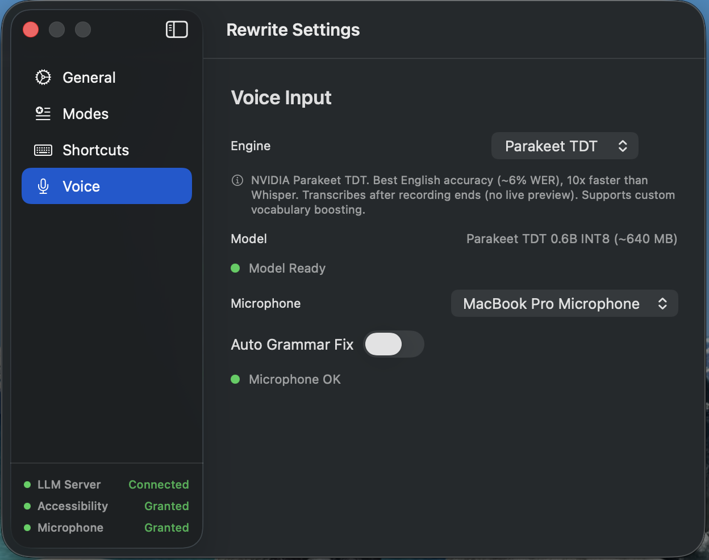

# Rewrite

<div align="center">

</div>

Rewrite is a macOS menu bar app for system-wide text rewriting and voice input. It reads the current selection through the Accessibility API, sends the text to a local LLM server, and can write the result back into the source app. Voice input runs on-device with either WhisperKit or Parakeet.

The app is built for people who want local-first writing tools:

- Rewrite selected text in any app
- Fix grammar in place with a single shortcut
- Open a popup with multiple rewrite modes
- Dictate into any text field with optional post-processing through your local LLM
- Keep text and audio on your machine

## How It Works

Rewrite combines four pieces:

1. A macOS menu bar app with global hotkeys.
2. The Accessibility API to read selections and replace or insert text in other apps.
3. An OpenAI-compatible local LLM endpoint for rewriting.
4. On-device speech-to-text for dictation.

For text rewriting, Rewrite calls:

- `POST /v1/chat/completions`
- `GET /v1/models`

That means it works with local servers that expose an OpenAI-style API, including Ollama and LM Studio when configured appropriately.

For speech-to-text, the app currently supports:

- `WhisperKit`: streaming partial transcription while you speak
- `Parakeet TDT`: faster end-of-recording transcription using the bundled `sherpa-onnx` runtime

## Features

- System-wide grammar fix and rewrite shortcuts
- Configurable rewrite modes with custom prompts
- Default quick-fix mode for silent in-place replacement
- Popup UI positioned near the current selection
- Voice dictation into the focused app
- Optional auto grammar correction after dictation
- Microphone selection
- First-run onboarding for Accessibility and LLM setup
- Launch at login


## Requirements

- macOS 13+
- A local LLM server that exposes an OpenAI-compatible API
- Accessibility permission
- Microphone permission for voice input

Recommended local LLM options:

- [Ollama](https://ollama.com)
- [LM Studio](https://lmstudio.ai)

## Install

### Prebuilt App

Download a DMG from the GitHub releases page:
- [Releases](https://github.com/sanathks/rewrite/releases)

Then:

1. Drag `Rewrite.app` into `Applications`.
2. If macOS blocks the app because it is unsigned, clear quarantine:

```bash
xattr -cr /Applications/Rewrite.app
```

3. Launch the app.
4. Grant Accessibility permission when prompted.

### Build From Source

Requirements:

- Xcode or Command Line Tools with Swift support
- Internet access for Swift Package Manager dependencies if they are not already cached

Build:

```bash
git clone https://github.com/sanathks/rewrite.git
cd rewrite
chmod +x Scripts/build.sh Scripts/install.sh
./Scripts/build.sh
```

Artifacts:

- `build/Rewrite.app`
- `build/Rewrite.dmg`

Architecture-specific builds:

```bash
./Scripts/build.sh arm64
./Scripts/build.sh x86_64
```

Local install:

```bash
./Scripts/install.sh
```

That copies the app to `~/Applications` and registers it with Launch Services.

## LLM Setup

Rewrite expects an OpenAI-compatible base URL.

Typical values:

- Ollama: `http://localhost:11434`
- LM Studio: `http://localhost:1234`

The app fetches available models from `/v1/models` and uses the selected model for rewrites.

Example with Ollama:

```bash
ollama pull gemma3
```

If you use LM Studio, load a model and start its local server before connecting Rewrite.

## Usage

### Text Rewriting

1. Launch Rewrite from the menu bar.
2. Select text in any supported app.
3. Press the grammar shortcut to silently replace the selection using the default mode.
4. Press the rewrite shortcut to open the result popup near the selection.
5. Use `Replace` to write the result back or `Copy` to place it on the clipboard.

Default shortcuts:

- Grammar fix: `Ctrl+Shift+G`
- Rewrite popup: `Ctrl+Shift+T`

The popup supports multiple modes and runs the selected mode on demand.


### Voice Input

1. Open Settings and choose a speech engine.
2. Download the required speech model.
3. Grant microphone permission.
4. Hold the speech shortcut while talking.
5. Release it to insert the transcript into the focused app.

Default voice shortcuts:

- Push-to-talk dictation: `Ctrl+Option+S`
- Hands-free dictation toggle: `Ctrl+Option+H`

If `Auto Grammar Fix` is enabled, dictated text is passed through the Fix Grammar mode before insertion.


### Rewrite Modes

Modes are user-editable. Each mode has:

- A display name
- A prompt
- Optional default-mode status

The app ships with these built-in presets:

- `Fix Grammar`
- `Clarity`
- `My Tone`
- `Humanize`

Modes can be reordered, edited, added, and removed from Settings.


## Settings

The settings window is organized into four sections:

- `General`: server URL, model refresh, launch at login
- `Modes`: manage rewrite modes and choose the default mode
- `Shortcuts`: rebind grammar, rewrite, dictation, and hands-free shortcuts
- `Voice`: choose STT engine, download speech models, choose microphone, toggle auto grammar fix



## Speech Engines

### WhisperKit

- Streaming transcription with partial results while speaking
- Multiple downloadable model sizes
- Good fit when live feedback matters

Current model options in the app:

- `Tiny`
- `Small`
- `Large v3 Turbo`

### Parakeet TDT

- End-of-recording transcription
- English-focused
- Uses the bundled `vendor/sherpa-onnx` package and downloads model files on demand

## Project Structure

```text
rewrite/
  Sources/Rewrite/        Swift app source
  Tests/RewriteTests/     Unit tests
  Resources/              App icons and Info.plist
  Scripts/build.sh        Build app bundle and DMG
  Scripts/install.sh      Install into ~/Applications
  vendor/sherpa-onnx/     Bundled Parakeet runtime dependency
  Package.swift           Swift Package manifest
```

## Notes

- Rewrite depends on Accessibility APIs, so behavior can vary across macOS apps.
- The app is local-first, but local model servers and speech model downloads still need to be installed separately.
- The build script signs the app with a `Rewrite Development` certificate if present, otherwise with ad-hoc signing.

## License

MIT
