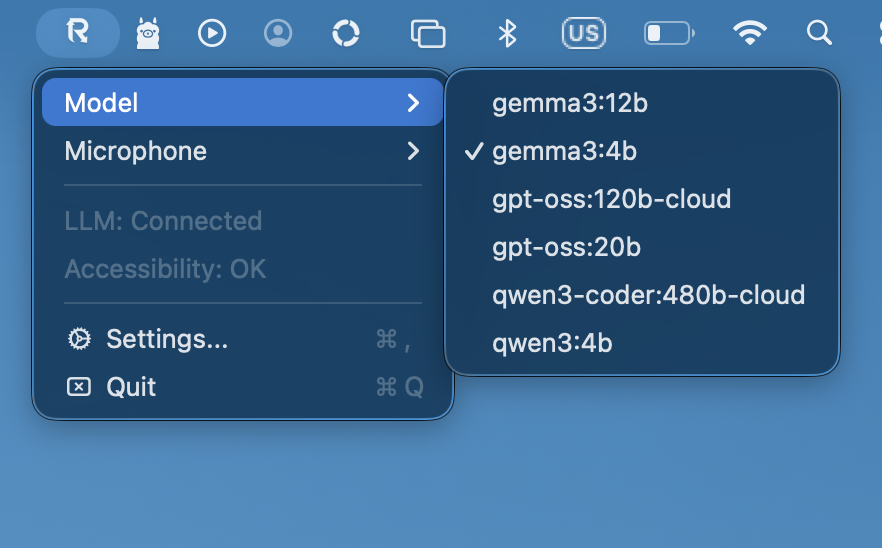
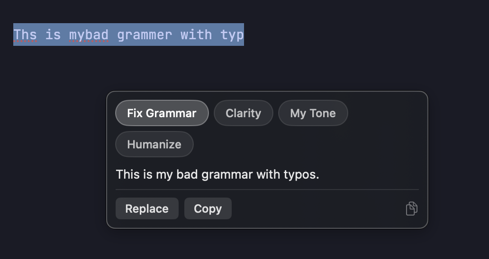
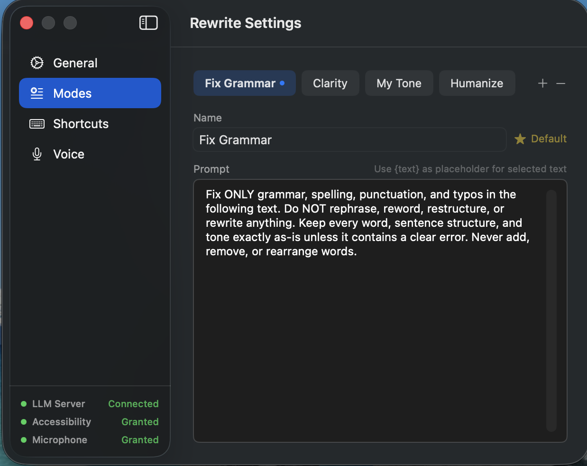

# Rewrite

<div align="center">

</div>

Rewrite is a macOS menu bar app that lets you fix grammar, rewrite text, and dictate — in any app, with your own local AI. Everything stays on your machine.



## What it does

- **Fix grammar** in any text field with a single shortcut — no copy/paste needed
- **Rewrite selected text** in multiple styles (clarity, tone, humanize, and more)
- **Dictate into any app** using on-device speech recognition
- **Customize your modes** — edit prompts, add your own styles, set a default

## Requirements

- macOS 13 or later
- [Ollama](https://ollama.com) or [LM Studio](https://lmstudio.ai) installed and running
- Accessibility permission (the app will prompt you on first launch)
- Microphone permission for voice input

## Install

Download the latest DMG from the [Releases page](https://github.com/sanathks/rewrite-mac/releases), drag `Rewrite.app` into your `Applications` folder, and open it.

If macOS says the app can't be opened because it's from an unidentified developer, run this once in Terminal:

```bash
xattr -cr /Applications/Rewrite.app
```

Then open the app normally.

## Setup

### 1. Install a local AI

Rewrite works with [Ollama](https://ollama.com) (recommended) or [LM Studio](https://lmstudio.ai).

With Ollama, pull a model to get started:

```bash
ollama pull gemma3:4b
```

### 2. Connect Rewrite

Open Rewrite from the menu bar, go to **Settings → General**, and make sure the server URL matches your setup. Ollama runs on `http://localhost:11434` by default — this is pre-filled.

Hit **Refresh Models**, select your model, and you're ready.

### 3. Grant permissions

The app will ask for Accessibility permission on first launch — this is needed to read and replace text in other apps. Voice input requires Microphone permission, which you'll be prompted for the first time you use it.

## Using Rewrite

### Fix grammar

Select any text in any app and press `Ctrl+Shift+G`. The text is silently fixed in place.

### Rewrite with options

Select text and press `Ctrl+Shift+T` to open a popup near your cursor with multiple rewrite styles. Pick a mode, then hit **Replace** to apply or **Copy** to grab it.



### Voice input

1. Open **Settings → Voice** and choose a speech engine (WhisperKit or Parakeet)
2. Download the model from the same screen
3. Hold `Ctrl+Option+S` to record, release to insert
4. Or use `Ctrl+Option+H` to toggle hands-free recording

Enable **Auto Grammar Fix** in Voice settings to automatically clean up your dictated text before it's inserted.


## Rewrite Modes

Modes are fully customizable. The app comes with:

- **Fix Grammar** — corrects errors without changing your words
- **Clarity** — makes text easier to read
- **My Tone** — adjusts tone while keeping your meaning
- **Humanize** — makes text sound more natural

Add your own, edit the prompts, reorder them, or set any mode as your default in **Settings → Modes**.



## Shortcuts

All shortcuts can be changed in **Settings → Shortcuts**.

| Action | Default |
|---|---|
| Fix Grammar | `Ctrl+Shift+G` |
| Rewrite popup | `Ctrl+Shift+T` |
| Push-to-talk | `Ctrl+Option+S` |
| Hands-free toggle | `Ctrl+Option+H` |

## Speech Engines

**WhisperKit** — shows a live transcript as you speak. Good for longer dictation where you want to see what's being captured.

**Parakeet TDT** — faster, transcribes when you stop speaking. English-focused and snappy for short inputs.

Both download their models on demand from Settings.

## Build from source

```bash
git clone https://github.com/sanathks/rewrite-mac.git
cd rewrite-mac
bash Scripts/build.sh
```

Output: `build/Rewrite.app` and `build/Rewrite.dmg`

## How it works

Rewrite uses macOS Accessibility APIs to read the selected text and write results back into the focused app. It calls a local LLM server (OpenAI-compatible API) for text rewriting, and runs speech recognition on-device using either WhisperKit or Parakeet via sherpa-onnx.

## License

MIT
